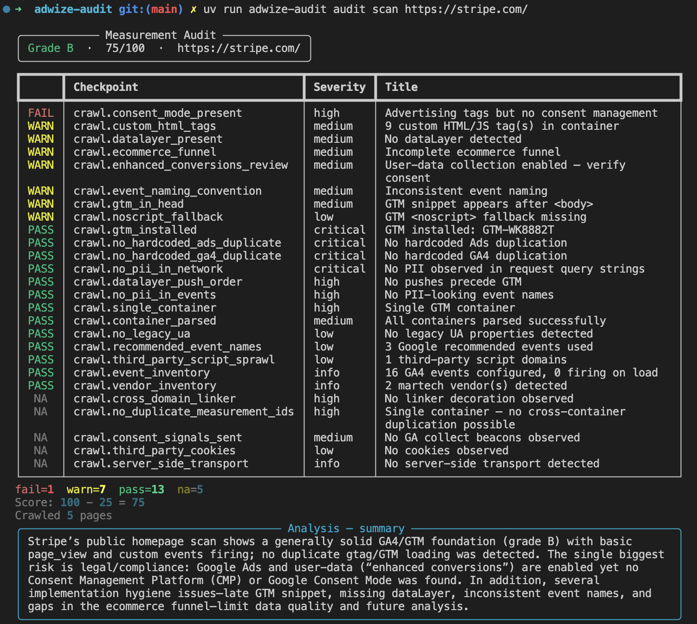

# adwize-audit

[](LICENSE)
[](https://www.python.org)
[](https://github.com/Adwize/adwize-audit/actions/workflows/ci.yml)

Audit any website's GA4 and GTM measurement setup from the outside. No Google account access required.

`adwize-audit` crawls a public page, parses the GTM container, runs **26 deterministic checks** against a checkpoint registry, and produces a **scored report (A-E)** with actionable findings. An optional LLM agent adds an analyst brief when you provide an OpenAI API key.



## What it checks

| Category | Examples |
|----------|----------|
| **Data Collection** | GTM installed and in `<head>`, single container, dataLayer order, event inventory, ecommerce funnel, recommended event names |
| **Data Quality** | No duplicate GA4/Ads tags (hardcoded + GTM), event naming convention, custom HTML tag count, third-party script sprawl |
| **Privacy** | Consent Mode configured and transmitted, PII in event names, PII in network requests, enhanced conversions review, third-party cookies |
| **Attribution** | Cross-domain linker decoration |

Each check produces a finding (pass / fail / warn / n/a) with a severity level. The final score starts at 100 and deducts points by severity — critical (25), high (12), medium (5), low (2).

## Quick start

```bash
# Clone and install
git clone https://github.com/Adwize/adwize-audit.git
cd adwize-audit
uv venv
uv sync --extra dev
uv run playwright install chromium

# Run your first audit
uv run adwize-audit audit scan https://example.com
```

## Configuration

Copy the sample env file (the CLI loads `.env` on startup):

```bash
cp .env.sample .env
```

| Variable | Purpose | Required |
|----------|---------|----------|
| `OPENAI_API_KEY` | Enables the LLM analyst brief | No — deterministic report works without it |
| `ADWIZE_MODEL_ANALYST` | Model for the analyst agent (default: `gpt-4o`) | No |
| `ADWIZE_MODEL_SCHEMA_MAINTAINER` | Model for schema discovery (default: `gpt-4o-mini`) | No |
| `ADWIZE_DATABASE_URL` | Postgres URL for shared storage (default: local SQLite) | No |
| `ADWIZE_SCHEMA_DIR` | Directory for agent-written schema overrides | No |

## Usage

```bash
# Basic scan — terminal output with grade + findings
adwize-audit audit scan https://example.com

# Save a full Markdown report
adwize-audit audit scan https://example.com --report ./audit.md

# Force-fetch a container that consent-gates the GTM snippet
adwize-audit audit scan https://example.com --container GTM-ABC123

# Deterministic only (skip LLM analyst)
adwize-audit audit scan https://example.com --no-analyze

# List and inspect stored runs
adwize-audit audit list
adwize-audit audit show <run_id>
```

Run any command with `--help` for full options.

See a [full example report (Stripe.com)](docs/example-audit-stripe.md) for what the `--report` output looks like.

## Architecture

```
core/           Audit engine
  collectors/     Playwright crawl + GTM container parser + vendor detection
  checks/         23 deterministic check functions → Finding objects
  registry/       Checkpoint definitions (YAML)
  schemas/        Knowledge base (GA4 events, CMP patterns, PII, vendors)
  models/         Pydantic data models
  scoring.py      100-point scoring → grade A–E

agents/         LLM agents (key-gated, optional)
  analyst/        Executive summary + deep-dive + next steps
  schema_maintainer/  Discovers and classifies unknown GTM tag functions

cli/            Typer CLI with Rich terminal output
storage/        Async SQLAlchemy persistence (SQLite default, Postgres optional)
report/         Markdown report generator
tests/          pytest suite
```

## Development

```bash
uv sync --extra dev
uv run playwright install chromium

# Run tests
uv run pytest

# Lint
uv run ruff check .
uv run ruff format --check .
```

## Contributing

See [CONTRIBUTING.md](CONTRIBUTING.md) for development setup, coding standards, and how to submit changes.

## License

[Apache-2.0](LICENSE)
